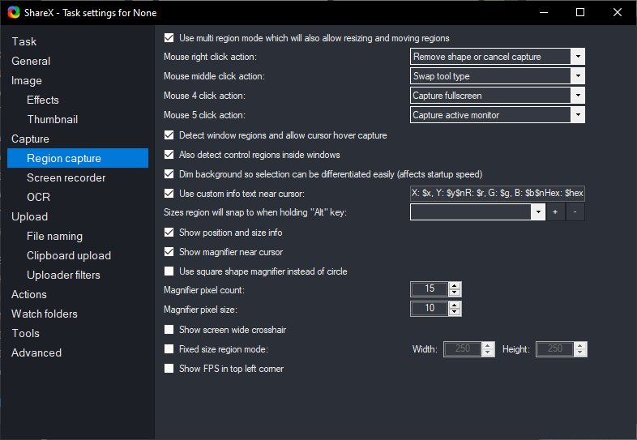

# ShareX Hotkey Menu Demo

- started - 2021-03-20
- ended - 2021-03-28

## What was done

- Hotkey Main window
- Partially Hotkey Edit window
- window resizing, dragging, z-index in order which open (based on browser size)
- ui design which need to improve

## Whats missing

- Many sections in edit - too complicated to implement
- Any interaction with state - its just demo

## How it should look like

# Wallpaper

- [Floor lamp near a wall](https://unsplash.com/photos/3LTht2nxd34) by [David van Dijk](https://unsplash.com/@dvandijk)
